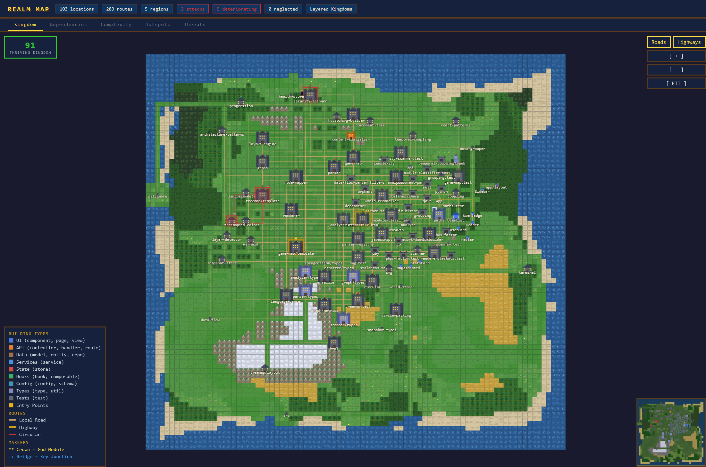
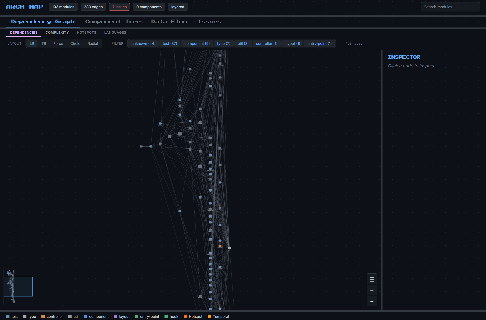
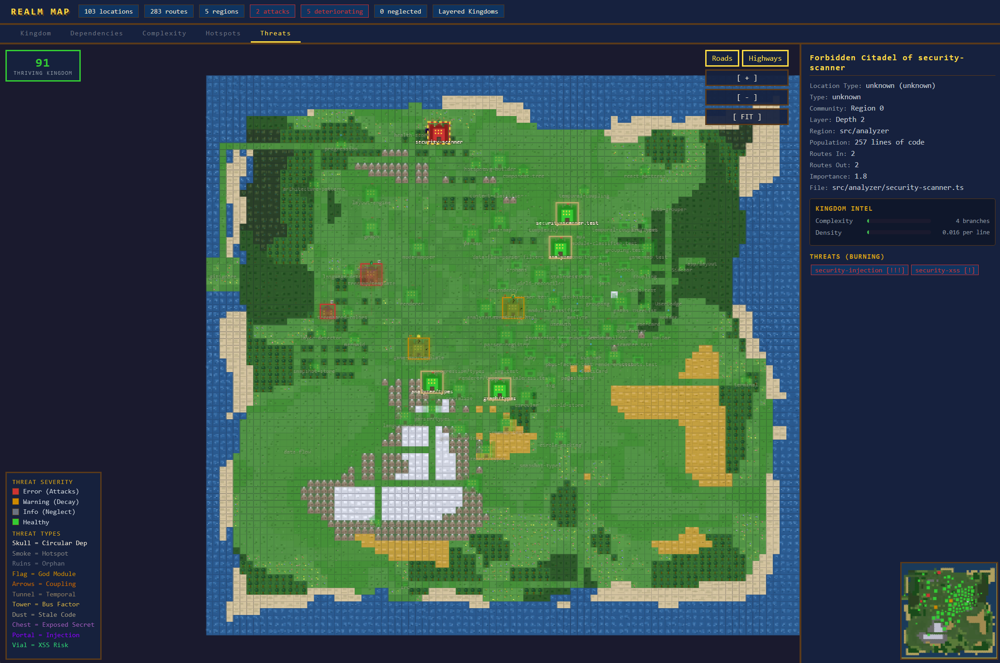

# codescape

[](LICENSE)
[](https://nodejs.org)

Analyze any codebase and generate interactive architecture visualizations. Point it at a project directory and get a self-contained HTML file you can open in a browser — no server required.

**10 languages. 5 output formats. Zero configuration.**



## Features

- **Multi-language** — JavaScript, TypeScript, Python, Go, Java, Kotlin, Rust, C#, PHP, Ruby
- **5 output formats** — Interactive graph, pixel-art game map, treemap, SVG circle-packing, Mermaid
- **Smart analysis** — Circular dependencies, god modules, orphans, layer violations, hotspots, temporal coupling
- **Framework-aware** — Recognizes 30+ frameworks (React, Next.js, Django, Spring, Rails, etc.)
- **Zero config** — Works out of the box on any project. Just point and run.
- **Self-contained output** — Every visualization is a single file with no external dependencies

## Quick Start

### Install from source

```bash
git clone https://github.com/jra805/visualization-cli.git
cd visualization-cli
npm install
npm run build
npm link
```

### Run

```bash
codescape analyze /path/to/your/project
```

The output opens automatically in your default browser.

## Output Formats

| Format          | Flag                   | Description                                       |
| --------------- | ---------------------- | ------------------------------------------------- |
| **Interactive** | `--format interactive` | Pan, zoom, click nodes, search — the default      |
| **Game Map**    | `--format game`        | Pixel-art RPG world map with biome-themed regions |
| **Treemap**     | `--format treemap`     | Squarified treemap sized by lines of code         |
| **SVG**         | `--format svg`         | Circle-packing diagram grouped by directory       |
| **Mermaid**     | `--format mermaid`     | Markdown-compatible flowchart                     |

```bash
codescape analyze . --format game
codescape analyze . --format treemap
codescape analyze . --format svg
codescape analyze . --format mermaid
```

## What It Detects

| Issue                 | Description                                                              |
| --------------------- | ------------------------------------------------------------------------ |
| Circular dependencies | Tarjan's SCC algorithm for JS/TS, regex-based for all others             |
| God modules           | Files with excessive fan-in + fan-out                                    |
| Orphan modules        | Disconnected files (with smart exclusions for expected standalone files) |
| Layer violations      | e.g., utility modules importing from UI layer                            |
| Architecture patterns | Detects layered, MVC, hexagonal, and modular patterns                    |
| Hotspots              | High cyclomatic complexity + frequent git changes                        |
| Temporal coupling     | Files that consistently change together                                  |
| Bus factor            | Files with only one contributor (via git history)                        |
| Stale code            | Files untouched for extended periods                                     |

## CLI Options

```
codescape analyze [dir] [options]

Arguments:
  dir                      Target project directory (default: ".")

Options:
  -o, --output <dir>       Output directory (default: opens in browser)
  --focus <path>           Focus on a specific subdirectory
  --depth <n>              Max directory depth to analyze
  --no-issues              Skip issue detection, diagrams only
  --format <type>          interactive | mermaid | game | treemap | svg
  --group                  Auto-group files by directory and module type
  --group-config <path>    Path to JSON group configuration file
  -v, --verbose            Verbose logging
```

## Examples

```bash
# Analyze a React app, save output to a directory
codescape analyze ~/projects/my-app --output ./diagrams

# Generate a pixel-art game map of a Go backend
codescape analyze ~/projects/api-server --format game

# Focus on a specific package in a monorepo
codescape analyze ~/projects/monorepo --focus packages/core

# Auto-group by directory for large projects
codescape analyze ~/projects/big-app --group
```

## Interactive Map



## Game Map

The game map format renders your codebase as a pixel-art RPG overworld:

- **Biomes map to architecture** — UI components live in forests, APIs on the coast, data layer in mountains, services in the castle
- **Building size reflects importance** — PageRank-based sizing
- **Threats are visible** — Circular deps, orphans, and hotspots appear as visual decay
- **Multiple lenses** — Switch between Kingdom, Dependencies, Complexity, Hotspots, and Threats views
- **Interactive** — Click buildings for details, pan/zoom the map, minimap navigation



## Requirements

- **Node.js 18+**
- **git** (for hotspot, temporal coupling, bus factor, and staleness analysis)

## Documentation

- **[Setup Guide](docs/SETUP.md)** — Detailed getting started guide with language-specific examples
- **[Contributing](CONTRIBUTING.md)** — Guidelines for adding languages, formats, and analyzers

## Development

```bash
npm install
npm run build          # Compile TypeScript
npm test               # Run tests (vitest)
npm run test:watch     # Watch mode
```

## Inspiration

This project was inspired by [a post on r/ClaudeAI](https://www.reddit.com/r/ClaudeAI/comments/1rp2qob/i_cant_read_code_so_i_made_claude_code_build_a/) where a user who couldn't read code had Claude Code build a tool to visualize it instead. That idea — making codebases understandable without reading every line — is exactly what codescape is about.

## License

[MIT](LICENSE)
