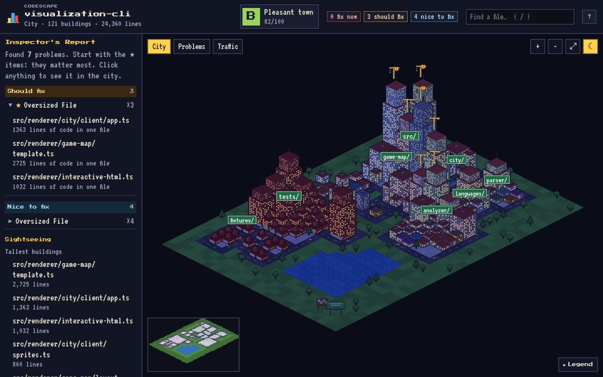
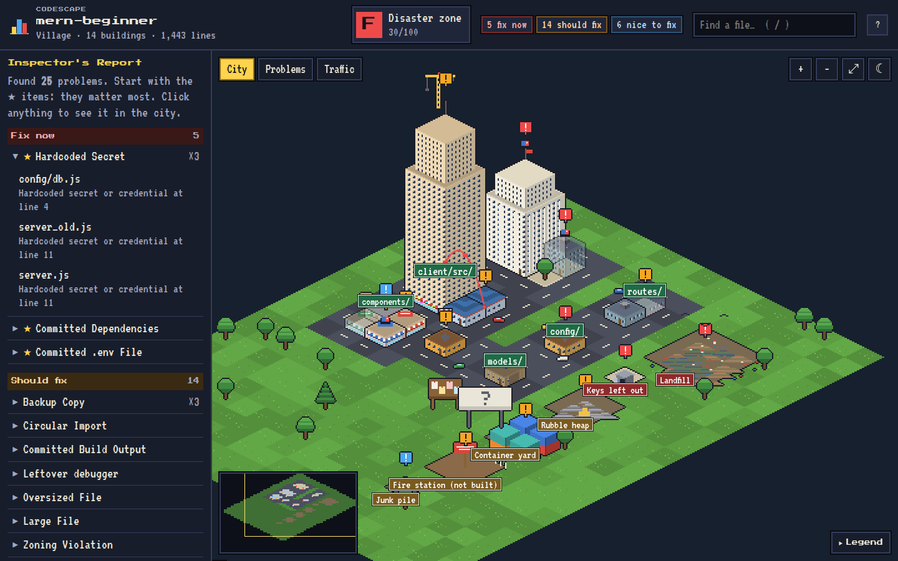
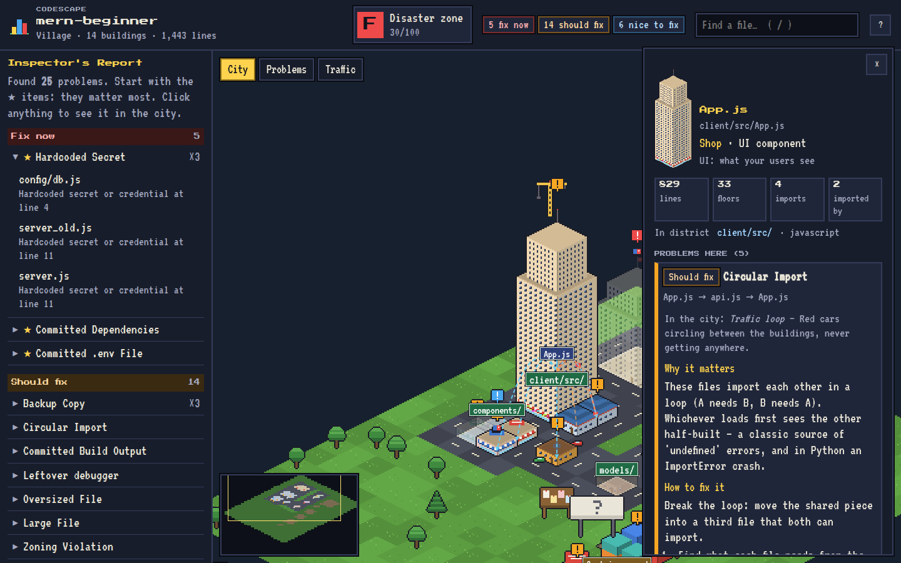

# codescape

[](LICENSE)
[](https://nodejs.org)

**See your code as an 8-bit city, and the beginner mistakes it's hiding.**



codescape turns a repository into a pixel-art city. Every folder is a district, every file is a building, and taller buildings have more lines of code. Problems look like city problems: a landfill where `node_modules` got committed, sirens on hardcoded secrets, red traffic loops for circular imports, and cranes on files that grew too big.

It's built for people learning to code. Every problem comes with a plain-English explanation of why it matters and the exact commands to fix it.

## Quick start

```bash
npx codescape-cli            # inspect the current folder
npx codescape-cli path/to/project
```

Or install it: `npm install -g codescape-cli`, then run `codescape` in any project. You need Node.js 18+ and, for the checks that look at what's committed, git.

The city opens in your browser, and the terminal prints the Inspector's Report:

```
   F   my-first-app — a village of 14 buildings
      Disaster zone · 30/100

  FIX NOW (5)
   ✖ Hardcoded Secret ×3 — config/db.js:4, server_old.js:11, server.js:11
   ✖ Committed Dependencies — 4 downloaded library files committed in node_modules/
       $ echo "node_modules/" >> .gitignore
       $ git rm -r --cached "node_modules"
   ✖ Committed .env File — .env is committed with 2 secrets: MONGO_URI, JWT_SECRET

  SHOULD FIX (14)
   ▲ Backup Copy ×3 — client/src/components/navbar_old.js, routes/users copy.js, server_old.js
   ▲ Circular Import — App.js → api.js → App.js
   ▲ Oversized File — 829 lines of code in one file  (client/src/App.js)
   ...
```

The output is a single HTML file written to a temporary folder, never into your project. It works offline; the pixel fonts are embedded.

## Reading the city



| You see              | It means                                                   |
| -------------------- | ---------------------------------------------------------- |
| A district (block)   | A folder. Sub-folders are neighbourhoods inside it         |
| A building           | A file. One floor ≈ 25 lines of code                       |
| **Shop**             | UI: components, pages, layouts                             |
| **Office**           | Routes, controllers, request handlers, middleware          |
| **Factory**          | Services: business logic                                   |
| **Warehouse**        | Data: models, schemas, repositories, migrations            |
| **Bank**             | State: stores, contexts, hooks                             |
| **Workshop**         | Helpers, config, types                                     |
| **City Hall**        | The entry point, where your program starts                 |
| **Fire station**     | Tests                                                      |
| **House**            | Everything else                                            |

Click any building, district or lot to see what it is, what it imports ("gets supplies from"), what imports it, and every problem found there. The **Problems** lens fades out healthy buildings. The **Traffic** lens lights up the files that everything depends on. Press `n` for night mode.



## What the inspector checks

Checks are tuned for precision: a false alarm teaches a beginner the wrong lesson. See [how accurate it is](#how-accurate-is-it).

**Fix now:** things that are actively hurting you.

| Problem                        | In the city            | Caught when                                                                      |
| ------------------------------ | ---------------------- | -------------------------------------------------------------------------------- |
| Committed dependencies         | Landfill               | `node_modules/`, a virtualenv, `vendor/bundle` … are tracked by git               |
| Committed `.env` / credentials | Keys left out          | `.env`, private keys, service-account JSON, `.npmrc` tokens are tracked           |
| Hardcoded secret               | Siren                  | API keys (AWS, GitHub, OpenAI, Stripe…), database URLs with passwords, `SECRET = "…"` |
| Injection risk                 | Siren                  | Values pasted into SQL, `eval`/`exec` of user input, shell commands from variables |

**Should fix:** real problems that will bite.

| Problem                                                     | In the city                  |
| ----------------------------------------------------------- | ---------------------------- |
| Circular import                                             | Red traffic loop             |
| Oversized file (500+ lines for UI, 1,000+ otherwise)       | Skyscraper with a crane      |
| Zoning violation (a helper, model or service imports UI)    | Orange wrong-way route       |
| Committed build output, database files, large files         | Rubble heap, container yard  |
| No `.gitignore`, no README, no tests                        | Notice board, blank welcome sign, unbuilt fire station |
| Backup copies (`server_old.js`, `users copy.js`) and duplicate files | Ghost buildings, clones |
| Leftover `debugger`, XSS risk, weak password hashing, mixed lockfiles, missing `requirements.txt` | Badges and roadblocks |

**Nice to fix:** unused files, junk files (`.DS_Store`, logs, `.idea/`), a README still from the template, `console.log` graffiti in UI files, hardcoded `localhost` API URLs, wildcard imports, debug mode left on, dev tools in `dependencies`, a cluttered root folder.

Each problem type costs points, with repeats costing less. The total maps to a grade from **A** (thriving city) to **F** (disaster zone), and every fix you make moves it.

## Options

```
codescape [dir] [options]

  -o, --output <path>      Write here (a folder or a .html file) instead of a temp folder
  --no-open                Don't open the browser
  --json                   Print the report as JSON (for CI, graders, scripts)
  --fail-on <severity>     Exit 1 if there are problems this urgent: error | warning | info
  --focus <path>           Only analyze a subfolder
  --depth <n>              Only include files this many folders deep
  --no-issues              Map only, no inspection
  --team                   Also check team history: single maintainer, stale files, hidden coupling
  -v, --verbose            List every problem in the terminal
  --format <type>          city (default) | treemap | svg | mermaid
```

In CI, `codescape --no-open --fail-on error` fails the build when anything "fix now" appears. `--json` gives each problem with its explanation and fix commands.

## Languages

The city works for JavaScript, TypeScript (including `.vue`, `.svelte` and `.astro`), Python, Go, Java, Kotlin, Rust, C#, PHP and Ruby. So do the repo-hygiene and security checks.

The import-graph checks (circular imports, unused files, zoning) run for **JavaScript, TypeScript and Python**, where an import names a specific file. Go, Java, C#, Rust, PHP and Ruby import packages or namespaces, or autoload files. For those languages, "nothing imports this file" would mostly be a false alarm, so codescape doesn't claim it.

## How accurate is it?

Every check was run against well-maintained projects, where it should stay quiet, and against planted beginner mistakes, where it should catch everything:

| Project                                   | Files | Grade      | Notes                                            |
| ----------------------------------------- | ----- | ---------- | ------------------------------------------------ |
| Express                                   | 141   | A (96)     | Two big files, noted as "nice to fix"             |
| gothinkster/node-express-realworld        | 36    | A (97)     |                                                  |
| shadcn/taxonomy (Next.js)                 | 125   | A (91)     | Has no tests, which is true                       |
| bulletproof-react                         | 412   | B (83)     | The same app is copied three times, which is true |
| Flask                                     | 83    | C (75)     | Real circular imports and a 1,300-line `app.py`   |
| djangoproject.com                         | 275   | D (67)     | A real API key committed in settings              |
| Beginner MERN app (test fixture)          | 14    | F (30)     | All 20+ planted mistakes caught                   |
| Beginner Flask app (test fixture)         | 5     | F (34)     | All planted mistakes caught                       |

Frameworks that deliberately do risky things score lower than apps do: Django `exec`s code in its shell command and keeps MD5 hashers for legacy passwords. The grade is meant for application code, not framework internals.

## Other formats

`--format mermaid` writes Mermaid diagrams you can paste into GitHub or GitLab markdown. `--format treemap` and `--format svg` show file sizes as a treemap and as circle packing. All three use the same analysis.

## Development

```bash
npm install
npm run build      # compile TypeScript (needed before running the CLI)
npm test           # vitest
node dist/index.js path/to/project
```

The city's browser code lives in `src/renderer/city/client/` as ordinary TypeScript. It's type-checked with everything else and inlined into the page. See [CONTRIBUTING.md](CONTRIBUTING.md) and the [audit and redesign notes](docs/AUDIT.md).

## Inspiration

Inspired by [a post on r/ClaudeAI](https://www.reddit.com/r/ClaudeAI/comments/1rp2qob/i_cant_read_code_so_i_made_claude_code_build_a/) where someone who couldn't read code had Claude Code build a tool to visualize it instead.

## License

[MIT](LICENSE). The embedded Press Start 2P and VT323 fonts are under the [SIL Open Font License](licenses/).
